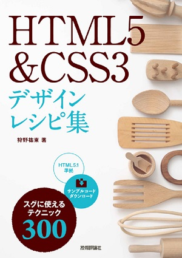

# 書籍「HTML5&amp;CSS3デザインレシピ集」（狩野祐東著／技術評論社刊）サンプルデータ

書籍「HTML5&amp;CSS3デザインレシピ集」（狩野祐東著／技術評論社刊）の開発版サンプルデータを公開します。ここで公開しているサンプルデータは、公式配布版になる前の、開発中のプレビューデータです。そのため、公式配布版とは内容が異なる場合があります。

なお、公式配布版のサンプルデータは下記技術評論社の書籍紹介ページからダウンロードできます。

## 本書の特徴
本書は、よく使う基本のマークアップから、実践的なレイアウト（`float`/`flexbox`）、アニメーション（`@keyframe`）まで、Webデザインに効く実用的なテクニックを満載した、HTML&CSSの逆引きリファレンスです。収録したサンプルは全部で300以上！「こういうことがしたい」と思ったとき、パッと引けてすぐに役立ちます。

リファレンスといっても、ただHTMLタグやCSSプロパティをひとつひとつを個別に取り上げ、説明しているわけではありません。複数のHTMLタグやCSSプロパティを組み合わせて構築する、実際のWebサイト構築に合わせた実用的なソースコードを用意しました。ページに掲載される要素をパーツ化して組み立てる、現代的なWebページのマークアップ作業を強力にサポートします。

* [出版社（技術評論社）の書籍紹介ページ](http://gihyo.jp/book/2017/978-4-7741-8780-8)
* 公式サンプルデータダウンロード
* 著者の書籍紹介ページ
* [Amazon](http://amzn.to/2ll7eOa)

## 書誌情報
書名：『HTML5&CSS3デザインレシピ集』
ISBN-13：978-4-7741-8780-8
著者：狩野祐東
刊行：2017年 2月 22日
仕様：640ページ、A5判
価格：本体 2,970円（税込）
発行：技術評論社

## 目次
### Chapter 1　HTML／CSSの基礎
001 HTMLの基礎知識  
002 Webサイトを構成するファイル  
003 CSSの基礎知識  
004 ボックスモデルを利用したCSSの適用  
005 CSSが適用される順序  
006 開発ツール  

### Chapter 2　ページの基本となるHTML
007 HTMLの基本マークアップ  
008 DOCTYPE宣言を書き換えたい  
009 ページの主要な言語を設定したい  
010 ページの文字コードセットを設定したい  
011 ページのタイトルを設定したい  
012 ページの概要を記述したい  
013 ページのキーワードを設定したい  
014 CSSファイルを読み込みたい  
015 CSSファイルの文字コードセットを指定したい  
016 CSSをHTMLに直接書きたい  
017 CSSをタグに直接書きたい  
018 JavaScriptファイルを読み込みたい  
019 JavaScriptをHTMLに直接書きたい  
020 JavaScriptが動作しないときのコンテンツを記述したい  
021 HTMLにコメントを残したい  
022 CSSにコメントを残したい  

### Chapter 3　テキストの整形とデザインテクニック
023 段落をマークアップしたい  
024 見出しを表示したい  
025 段落内で改行したい  
026 テキストの一部を強調したい  
027 テキストの一部を太字にしたい  
028 プログラムのソースコードを表示したい  
029 連絡先を表示したい  
030 上付き文字や下付き文字を表示したい  
031 まとまった量のテキストを引用して表示したい  
032 短いテキストを文中で引用して表示したい  
033 日付や時刻を表示したい  
034 テキストの一部にマーカーをつけたい  
035 読みがなのルビを振りたい  
036 略語であることを表現したい  
037 テキストの一部を訂正したことを示したい  
038 テキストを新たに挿入したことを示したい  
039 短いソースコードを表示したい  
040 ツールチップを表示したい  
041 コピーライトを表示したい  
042 HTMLで使用できない記号を表示したい  
043 テキスト色を変更したい（16進数）  
044 テキスト色を変更したい（RGB）  
045 半透明なテキスト色を指定したい（RGBA）  
046 要素ごとにフォントサイズを指定したい  
047 ページ全体のフォントサイズを相対的に指定したい  
048 行間を広くしたい・狭くしたい  
049 リード文を太字にしたい  
050 見出しのテキストを通常の太さにしたい  
051 イタリックで表示される要素を通常のテキストに戻したい  
052 テキストの行揃えを変更したい  
053 文字と文字の間隔を広くしたい・狭くしたい  
054 テキストに字消し線を引きたい  
055 好きな色のマーカーをつけたい  
056 段落の前後のスペースをなくしたい  
057 段落ごとに字下げ（インデント）したい  
058 1文字目だけ大きくしたい  
059 段落の1行目だけ見た目を変えたい  
060 引用の前後にテキストを挿入したい  
061 テキストの前後に記号を挿入したい  
062 引用符を自由に指定したい  

### Chapter 4　リストのデザインテクニック
063 箇条書きを表示したい  
064 番号付きの箇条書きを表示したい  
065 箇条書きを1以外の数からスタートさせたい  
066 「キーワード」と「説明」をセットで表示したい  
067 キーワード」と「説明」のレイアウトを変えたい  
068 箇条書きのマークを変更したい  
069 箇条書きのナンバリングを変更したい  
070 箇条書きのマークを画像にしたい①  
071 箇条書きのマークを画像にしたい②  
072 箇条書きのマークでランキングを表現したい  

### Chapter 5　リンクと画像のテクニック
073 サイト内のほかのページにリンクしたい  
074 別のサイトへリンクしたい  
075 リンク先を別タブで開くようにしたい  
076 ページ内リンクを設定したい  
077 ページ内リンクで移動した先の見た目を変化させたい  
078 メールアドレスをリンクにしたい  
079 電話番号をリンクにしたい  
080 PDFファイルをダウンロードさせたい  
081 リンクテキストのスタイルを指定したい  
082 マウスがホバーしたときにテキストを半透明にしたい  
083 リンクの下線を点線にしたい  
084 マウスがホバーしたときに背景色をつけたい  
085 マウスがホバーしたときに枠線をつけたい  
086 スマートフォンのハイライト色を変更したい  
087 画像を表示したい  
088 base64のデータで画像を表示したい  
089 SVG形式の画像ファイルを表示したい  
090 SVGのデータを直接埋め込みたい  
091 画像にリンクをつけたい  
092 画像を半透明にしたい  

### Chapter 6　ページ全体に適用するデザインのテクニック
093 ウィンドウ外周のマージンをなくしたい  
094 ページ全体の背景色を設定したい  
095 ページ全体のフォントを設定したい  
096 ページ全体に背景画像を敷きつめたい  
097 ページ全体に適用した背景画像の位置を固定したい  
098 ページの上から下にグラデーションをかけたい  
099 リセットCSSを適用したい  
100 ノーマライズCSSを適用したい  
101 サニタイズCSSを適用したい  

### Chapter 7　ボックスの整形とデザインテクニック
102 基本のボックスを作成したい  
103 「記事」「セクション」のボックスを作成したい  
104 そのページの中心的なコンテンツが含まれるボックスを作成したい  
105 ボックス全体をリンクにしたい  
106 図とキャプションを表示したい  
107 ページの一部分にほかのHTMLを表示したい①  
108 ページの一部分にほかのHTMLを表示したい②  
109 ボックスにボーダーをつけたい  
110 ボーダーとコンテンツの間にスペースを作りたい  
111 ボックスとボックスの距離を離したい  
112 見出しに下線をつけたい  
113 枠線で見出しをデザインしたい  
114 ボックスの幅と高さを指定したい  
115 ボックスの高さを固定してスクロールバーを表示させたい  
116 ボックスの高さを固定してコンテンツを非表示にしたい  
117 1行で収まらないテキストを省略したい  
118 アイコンとテキストの位置を揃えたい  
119 ボックスと画像の下に空くスペースをなくしたい  
120 ボックスの背景色を指定したい  
121 ボックスの背景に画像を適用したい  
122 ボックスの背景に線状グラデーションをかけたい  
123 ボックスの背景に放射状グラデーションをかけたい  
124 背景画像を横方向にだけ繰り返したい  
125 背景画像を縦方向にだけ繰り返したい  
126 背景画像が繰り返さないようにしたい  
127 背景画像をボックスの真ん中に表示したい  
128 背景画像の表示位置を数値で指定したい  
129 背景画像のサイズをボックスに合わせて変化させたい①  
130 背景画像のサイズをボックスに合わせて変化させたい②  
131 複数の背景画像を表示させたい  
132 ボーダーを画像にしたい  
133 ボックスを角丸四角形にしたい  
134 ボックス全体を半透明にしたい  
135 ボックスにドロップシャドウをつけたい  
136 ボックスの内側にシャドウをつけたい  

### Chapter 8　テーブルのデザインテクニック
137 テーブルの基本マークアップ  
138 テーブルに標準的な罫線をつけたい  
139 テーブルの見出しセルを作成したい  
140 セルを横方向に結合したい  
141 セルを縦方向に結合したい  
142 テーブル行をヘッダー，ボディ，フッターに分けたい  
143 テーブル上部にキャプションをつけたい  
144 テーブル下部にキャプションをつけたい  
145 セル内のテキストの行揃えを変更したい  
146 セル内のコンテンツと罫線の間にスペースを作りたい  
147 テーブルの各行に下線を引きたい  
148 セルのサイズを固定したい  
149 テーブル全体の幅を指定のサイズで固定したい  
150 セルの幅を均等にしたい  
151 テーブル全体の背景を設定したい  
152 見出し行にだけ背景を設定したい  
153 テーブルの背景色を奇数行と偶数行で塗りわけたい  
154 マウスが重なった行の背景色を変更したい  
155 テキストが折り返さないセルを指定したい  

### Chapter 9　フォームのデザインテクニック
156 フォームの基本マークアップ  
157 テキストフィールドを表示したい  
158 フォーム部品にラベルをつけたい①  
159 フォーム部品にラベルをつけたい②  
160 メールアドレス入力用テキストフィールドを表示したい  
161 電話番号入力用テキストフィールドを表示したい  
162 パスワード入力のテキストフィールドを表示したい  
163 テキストフィールドに入力のヒントを表示したい  
164 最初のフォーム部品を自動で選択したい  
165 必須入力項目にしたい  
166 コピーはできるけれども入力はできない特殊なテキストフィールドを作りたい  
167 ファイルをアップロードできるようにしたい  
168 ラジオボタンを表示したい  
169 チェックボックスを表示したい  
170 プルダウンメニューを表示したい  
171 複数の項目を選択できるリストを表示したい  
172 プルダウンメニューの項目をグループ化して見やすくしたい  
173 テキストエリアを表示したい  
174 非表示データを埋め込みたい  
175 フォームの一部をグループ化したい  
176 送信ボタンを表示したい  
177 送信ボタンを画像にしたい  
178 汎用的なボタンを作成したい  
179 テキストフィールド・テキストエリアのスタイルを調整したい  
180 テキストフィールド・テキストエリアの余白を調整したい  
181 選択されたらテキストフィールドの色を変えたい  
182 入力チェックで引っかかったテキストフィールドのスタイルを変更したい  
183 送信ボタンの見た目を変更したい  
184 ラベルとテキストフィールドを横に並べて整列させたい  

### Chapter 10　メタデータと外部サイトとの連携テクニック
185 ファビコンを設定したい  
186 印刷用のCSSを読み込みたい  
187 Font Awesomeを使いたい  
188 Webフォント「Google Fonts」を使用したい  
189 ページが検索されないようにしたい  
190 アクセスキーを設定したい  
191 タブキーの選択順序を設定したい  
192 5秒後に別のページに移動したい  

### Chapter 11　パーツ作成のテクニック
193 タイトルとサブタイトルを表示したい  
194 キーボードの字をキーボードらしく見せたい  
195 リンク先が別ウィンドウで表示される場合にアイコンを表示したい  
196 PDFなど特定のファイルへのリンクだけアイコンや囲みを表示したい  
197 テキストをカプセル型に囲みたい  
198 テキストに太いペンで引いたような下線をつけたい  
199 タグのスタイルを変更したい  
200 パンくずリストを作成したい  
201 記事に付属するキーワードやタグを表示をしたい  
202 アイコンとテキストが上下に並ぶボタンを作りたい  
203 画像にテキストを回り込ませたい  
204 図にテキストを回り込ませたい  
205 フロートを解除したい　パターン①（clear）  
206 ボックスを横に並べたい（float版）  
207 フロートを解除したい　パターン②（overflow）  
208 フロートを解除したい　パターン③（clearfix）  
209 ボックスの上部だけ角を丸くしたボタンを作りたい  
210 引用ブロックに装飾された「❝」「❞」を表示したい  
211 縦に並んだナビゲーションを作りたい  
212 縦に並んだナビゲーションの各項目に矢印のマークを表示したい  
213 見出しがついたボックス（パネル）を作成したい  
214 タブボタンを作成したい  
215 ページネーションを作成したい  
216 サムネイル画像とテキストを横に並べたい  
217 写真に枠線をつけたい  
218 正方形の画像を円形に切り抜きたい  
219 画像の上に別の画像を重ねて表示したい  
220 画像の上にテキストを重ねたい  
221 バッジを重ねて表示したい  
222 実際のサイズとは異なる大きさで画像を表示したい  
223 ウィンドウ幅いっぱいに背景画像を表示したい①  
224 ウィンドウ幅いっぱいに背景画像を表示したい②  
225 ウィンドウ幅に合わせて伸縮するキービジュアルを作成したい  
226 カレンダーを表示したい  
227 検索フィールドの中に虫眼鏡アイコンを表示させたい  
228 テキストフィールドのすぐ横に送信ボタンを配置したい  
229 プルダウンメニューの見た目を変えたい  
230 ローディングサインを表示したい  

### Chapter12　ナビゲーションのデザインテクニック
231 一般的なナビゲーションのマークアップ（HTML5版）  
232 一般的なナビゲーションのマークアップ（XHTML版）  
233 スマートフォン向けのグローバールナビゲーションを作成したい  
234 パソコン向けのグローバルナビゲーションを作成したい（float版）  
235 いま閲覧しているページのナビゲーションリンクをハイライトさせたい  
236 画像を使ったナビゲーションを作成したい（float版）  
237 パソコン向けのグローバルナビゲーションを作成したい（flexbox版）  
238 ナビゲーションの各項目を右揃えにしたい（flexbox版）  
239 ナビゲーションの各項目を中央揃えにしたい（flexbox版）  
240 ナビゲーションの各項目を均等に配置したい①（flexbox版）  
241 ナビゲーションの各項目の間隔を均等にしたい②（flexbox版）  
242 ナビゲーションの各項目を同じ大きさにしたい（flexbox版）  
243 ナビゲーションの最後の項目だけ右に配置したい（flexbox版）  
244 サイトや企業のロゴをヘッダーに表示させたい  
245 ヘッダーに検索フォームをつけたい  

### Chapter 13　レイアウトのテクニック
246 伸縮するシングルコラムレイアウトを作成したい  
247 固定幅で中央揃えのシングルコラムレイアウトを作成したい  
248 伸縮する2コラムレイアウトを作成したい（float版）  
249 2コラムレイアウトの左右を入れ替えたい（float版）  
250 幅が固定された2コラムレイアウトを作成したい（float版）  
251 伸縮する2コラムレイアウトを作成したい（flexbox版）  
252 2コラムレイアウトの左右を入れ替えたい（flexbox版）  
253 伸縮する3コラムレイアウトを作成したい（float版）  
254 幅が固定された3コラムレイアウトを作成したい（float版）  
255 伸縮する3コラムレイアウトを作成したい（flexbox版）  
256 3コラムレイアウトの位置を入れ替えたい（flexbox版）  
257 伸縮するレイアウトの上限幅を決めたい  
258 ナビゲーションをウィンドウ上部に固定したい  
259 ページ下部にキャンペーンブロックを表示したい  
260 サイドメニューがスクロールしない2コラムレイアウトを作成したい  
261 フッターのコピーライトと住所をそれぞれ左揃え，右揃えにしたい（float版）  
262 コピーライトと住所表記をそれぞれ左揃え，右揃えにしたい（flexbox版）  
263 イメージの上にロゴを重ねたい  
264 背景画像をスクロールしないようにしたい  
265 フッターにサイトマップを掲載したい  
266 ボックスを整列して並べたい（float版）  
267 ボックスを整列して並べたい（flexbox版）  
268 多数のボックスを整列して並べたい（float版）  
269 多数のボックスを整列して並べたい（flexbox版）  

### Chapter 14　レスポンシブWebデザインに対応するテクニック
270 レスポンシブWebデザインに対応するための基本マークアップ  
271 画面サイズに合わせてCSSを切り替えたい  
272 電話番号がリンクにならないようにしたい  
273 スマートフォン向けのファビコンを設定したい  
274 スマートフォンとパソコンでページ全体のフォントサイズを変更したい  
275 シングルコラムレイアウトを2コラムレイアウトに切り替えたい（float版）  
276 シングルコラムレイアウトを3コラムレイアウトに切り替えたい（flexbox版）  
277 ナビゲーションのデザインを変えたい（float版）  
278 ナビゲーションのデザインを変えたい（flexbox版）  
279 画面幅が広いときだけ，画像にテキストを回り込ませたい  
280 スマートフォンのときはテーブルを横スクロールできるようにしたい  
281 テーブルの見た目を見出し＋本文に切り替えたい  
282 フォーム部品を伸縮させたい  

### Chapter15　アニメーションとエフェクトのテクニック
283 区切り線を引きたい  
284 区切り線のスタイルを変更したい  
285 区切り線の途中にテキストを表示したい  
286 区切り線をグラデーションで表現したい  
287 テキストにドロップシャドウをつけたい  
288 テキストの選択ハイライト色を指定したい  
289 動画ファイルを表示したい  
290 動画をキービジュアルにしたい  
291 テキストを斜めにしたい  
292 ホバーしたときにテキストの傾きを変えたい  
293 画像にホバーしたとき透明度を徐々に変化させたい  
294 画像にホバーしたとき画像を徐々に拡大させたい  
295 画像にホバーしたときに，明度が上がる効果をつけたい  
296 画像にホバーしたときにセピア色にする効果をつけたい  
297 画像にホバーしたときに浮きあがるような効果をつけたい  
298 画像にホバーしたときに回転させたい  
299 画像の色が変化するアニメーションを設定したい  
300 バッジが小刻みに揺れるアニメーションを設定したい  

Index